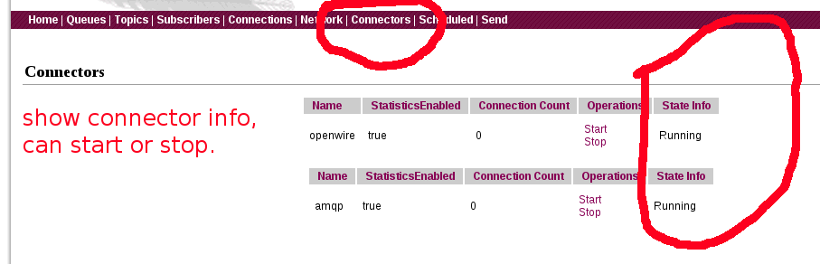
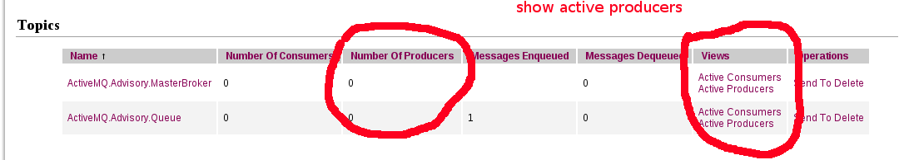
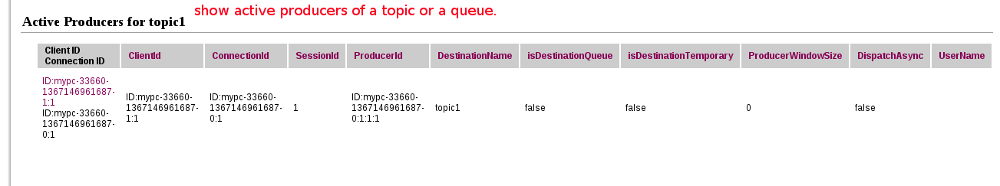
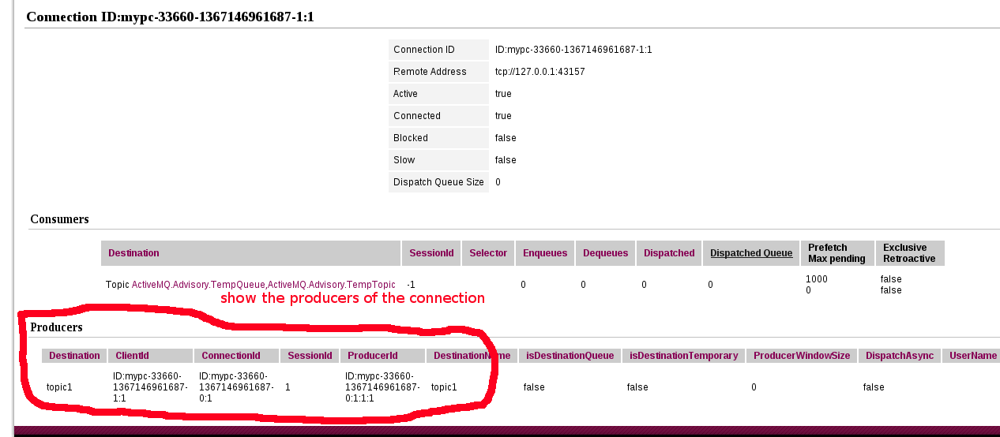

## ActiveMQ-WebConsole修复增强版
这个修复增强版基于ActiveMQ5.8.0：http://activemq.apache.org/activemq-580-release.html 。
 
修复了一些显示的bug，并增强了web console的功能。

- 修复不能显示connection信息的问题：
[AMQ-4393](https://issues.apache.org/jira/browse/AMQ-4393)

- 增加显示connector的状态，并可以手动启动/停止
- 增加显示Queue/Topic的producer的数量
- 增加显示Queue/Topic的生产者的信息
- 增加显示connection的producter信息

个人认为手动启动/停止 connector，这个功能很实用。
 
可以在broker中配置两个connector，即两个端口inputPort和outputPort，生产者连接inputPort，消息者连接outputPort。
那么，当想要停止ActiveMQ时，可以先把inputPort的connector停止掉，等确认消息已经全部被消息了，再停止outputPort的connector。
这样可以很方便地实现关流量的效果，而不用在应用层关流量。修改ActiveMQ的配置或者升级ActiveMQ都会非常方便。

### 下载
activemq-5.8.0-webconsole-enhanced.tar.gz 是本人编译打包的一个版本，可以直接使用。也可以下载patch，自己编译。

### 补丁
在patches文件夹里有对应各个子项目的patch文件。
 
可以从官方网站找到svn地址，自行把代码checkout下来，再打上patch。

### 改进增强的图片展示
详细的地方可以看pictures文件夹里的图片。

- 显示connector的状态，并可以手动启动/停止

- 显示Queue/Topic的producer的数量

- 显示Queue/Topic的生产者的信息

- 显示connection的producter信息

### TODO
- 增加显示Queue/Topic的内存使用
- 在5.8.0版本中，官方把camel的web管理界面去掉了，这个有没有必要再加回去？
